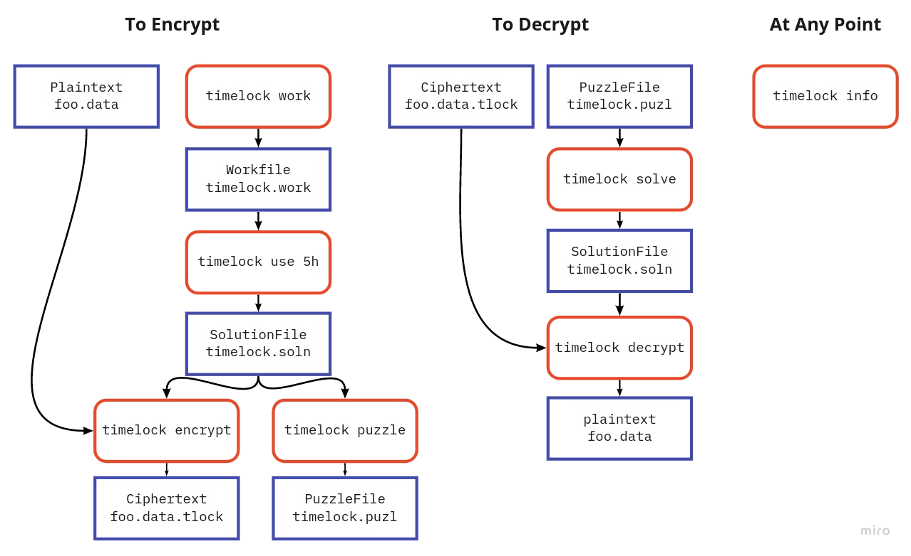

# Timelock

Rust implementation of [chained hashes timelock encryption](https://www.gwern.net/Self-decrypting-files#hashing) using SHA256.

## Install

[Install Rust](https://rustup.rs/) then simply:

```
cargo install --git https://github.com/kj800x/timelock
```

## Usage



### Generate Work

First you need to invest work to create a WorkFile. The idea is that you can do this step in parallel,
but you must invest as many computations as you want to require for the decryption. Running `timelock work`
will generate a `timelock.work` file.

```
$ timelock work
Work is being generated... Press CTRL+C to stop and save progress.
^C
Chain 0: 7251387 iterations
	Initial Seed: 4364e02bd9a02bc454618bf3236a61efca37ecc4f8e020b6c43fe8b06e3f3d26
	Result Hash : 9ee1c5cf736f32b52070ee3243d130dc740c7e925e913d96fed7e63edd5ce507
Chain 1: 7258992 iterations
	Initial Seed: 5876611691e037255e7a6962ae1200c45aaf3ad5f027caf300f120f9c8849466
	Result Hash : 6f13dd8c674432977e8db34bff070dd5f898325d2cf0015e8db95649da6c0783
Chain 2: 7245372 iterations
	Initial Seed: ed020414ae18f61d48f5f177d6ec527d54f008643aef883c5e665561386ec292
	Result Hash : d8d739b4af8a5def80e96366e997745222b69e8b0458d57c73ff5b88ee9583f2
Chain 3: 7253198 iterations
	Initial Seed: 9da6fbef4bad455a7a1836e355b9cb7187e60a357ce3ca93bae3bff65e26dbc6
	Result Hash : 64dca90ab10a39ffef9e826140fd7522ddfefc2831e5914149ec4b31f0926bfe
```

- You can chose how many parallel threads you want to be generating work with the `-p` argument.
- You can re-run `timelock work` to continue to append additional computation power to your WorkFile.
- You can also simply concatenate multiple WorkFiles to create a WorkFile with the combined computation power.

### Select amount of work to use

Once you have invested a sufficient amount of time into a WorkFile, to encrypt a file you need to first select how much of that work you want to use for the current puzzle and write that out as a SolutionFile. It's important that you don't reuse work for multiple puzzles, as that weakens the encryption. `timelock use` will automatically remove the chosen work from the WorkFile and move it into a SolutionFile for you.

```
$ timelock use 5h
```

The positional argument to `timelock use` is a computation amount. You can either specific a number of hashes as a whole number, or you can specify a whole number amount of time. The units of time which are accepted are `s`, `m`, `h`, `D`, `M`, `Y`, for seconds, months, hours, days, months, years respectively. If you specify an amount of time, timelock will attempt to calculate the approximate hash rate of your computer and use that as a basis to calculate the computation amount.

Since `timelock use` must use whole chains, it may chose a computation amount which is larger than what you specified. For this reason, you may want to use the `-c` argument to `timelock work` to adjust the length of each individual chain.

### Build a puzzle

Using the SolutionFile, you can generate a corresponding PuzzleFile which you can make public.

This time complexity of this command is linear with respect to the number of chains, which means it
should be near instant (you normally have a reasonable number of chains, and each chain has a high iteration count).

```
$ timelock puzzle
```

### Encrypt a file

Using the SolutionFile, you can use AES256 to encrypt a file.

```
$ timelock encrypt plaintext ciphertext
```

### Sharing a crypto puzzle

To share a puzzle, you need to share the ciphertext along with the PuzzleFile. Anyone who is interested in investing
enough computational power will be able to decrypt your message, but you can be sure that they have invested the hashing
power required. Disclaimer: I don't see a way to solve this faster than doing the required hashes to solve the key,
but that gives no guarantees about someone smarter than me.

### Estimate difficulty

You can run `timelock info` to get statistics about your computer's computational power and the estimated time to solve for a
WorkFile or PuzzleFile. Keep in mind that this is an estimated time to solve **on your machine**, and the time to solve will
vary greatly based on available computation power. An ASIC can compute these hashes [way faster than your laptop
can](https://en.bitcoin.it/wiki/Mining_hardware_comparison).

```
$ timelock info
Calculating approximate hash rate...

This computer can calculate about 3491563 hashes per second

The PuzzleFile contains the work of 26385959 hashes
It would take about 7 seconds to solve the PuzzleFile
```

### Solve a puzzle

You can solve a PuzzleFile and reconstruct the corresponding SolutionFile with `timelock solve`. This process can potentially
take a long time.

```
$ timelock solve
Beginning to solve chain 0 which is 6594290 computations long
Beginning to solve chain 1 which is 6594612 computations long
Beginning to solve chain 2 which is 6607702 computations long
Beginning to solve chain 3 which is 6589355 computations long
Puzzle solved!
```

### Decrypt a file

Using the reconstructed SolutionFile, you can use AES256 to decrypt a file.

```
$ timelock decrypt ciphertext plaintext
```

# License: [MIT](./LICENSE)
